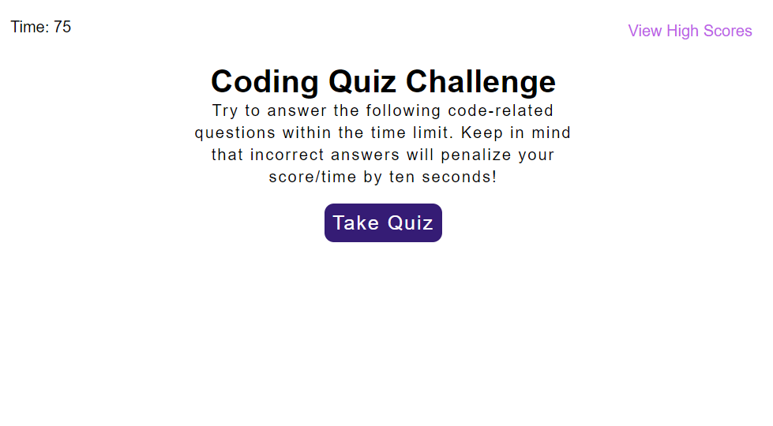
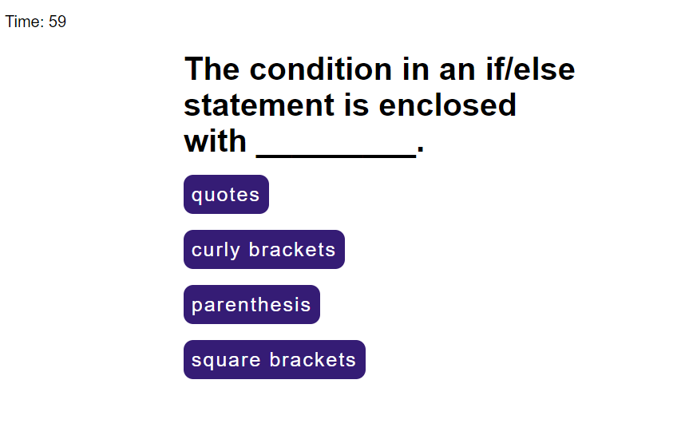

# Code Quiz

## Purpose
This is a game to educate those studying JavaScript by quizzing them on JavaScript questions.  The quiz includes 5 questions and a timer.  Participants are penalized in time for wrong questions and get extra points for answering correctly. The five highest scores are saved to local storage and displayed on a High Scores page. The scores entry is validated by JavaScript to make sure participants only submit their initials. Many page elements are created and populate the page "on the fly" in JavaScript via DOM, such as the buttons and the pages. 
 
 

All the HTML, CSS and JavaScript were created by me although I kept true to the design of the challenge mockup with the purple buttons and page set-up.
 
 

# Built With
- HTML
- CSS
- JavaScript
  

# Website

[Github Pages](https://webprinc3ss.github.io/code-quiz/)

 

# Media

 

# Credit
JavaScript hand-coded by webprinc3ss (me).

